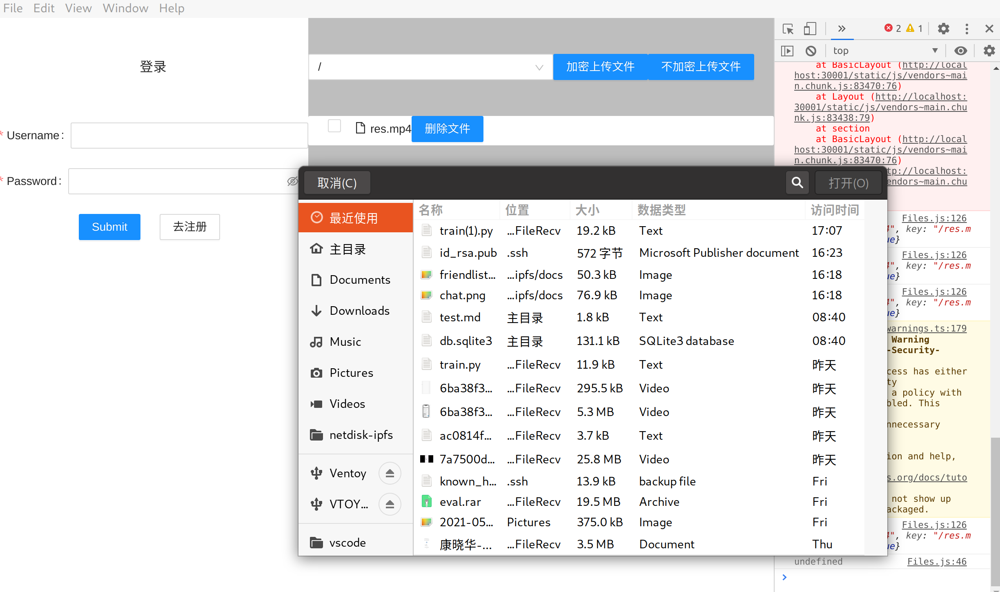
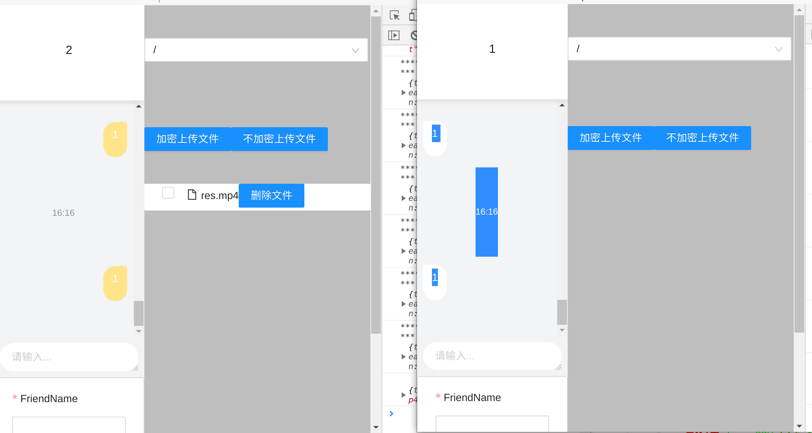
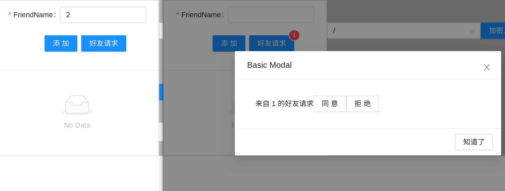
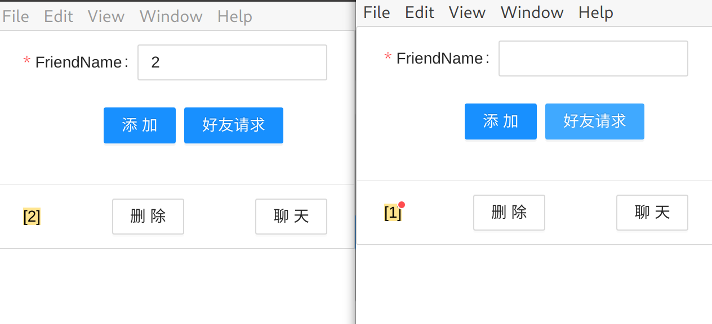

# 项目简介

## 起源

> 这是FredyVia的国创项目，虽然历时2年，其中水了一年（积累知识中..哈哈）但对于最后还算做了些东西。
> 首先立项时我们是做ipfs路由层kademlia算法研究的，但是当时才大一菜的一，啥也不懂，老师说啥就是啥，也没考究，对于项目调研有失偏颇，导致了后面ipfs中的路由算法已经最优，我们的项目也一度停滞。

## 摘要

> 在各大网盘纷纷倒闭，百度网盘限速的情况下，自建网盘开始出现，我们实现了一套基于ipfs的自建网盘系统，它包含了聊天的子系统，他相比于其他自建网盘，好处在于内网穿透上，我们可以在外网访问内网的数据，对于开放数据，我们可以通过从含有该文件的其他地方分片下载，最大化我们的下载速度。

## 对于路由算法的研究

> 对于kademlia算法来说，对于节点的选择是“随机”的，其使用逻辑距离最近作为其选择最优对等点的依据，而逻辑距离计算是通过节点id计算海明距离实现的，节点id的生成是随机的，所以可能选择的逻辑距离最近，但物理距离或者更准确地来说延迟是很大的。我们旨在找到一种路由算法使其基于物理距离的最小或者更准确来说节点间的时延最小。目前的研究已有基于时延的kad路由算法，但基于时延的算法需要定期地向对等点发送时延检测包，而这对于对等点间交换信息较少的对等点来说是有失偏颇的，我们旨在改进目前基于时延的算法，我们希望找到一种可以替代基于时延的算法，采用其他信息去表征时延信息，如基于IP地址，两个ip地址间的海明距离可以成为可选的表征时延的方法，但目前ipfs采用libp2p作为其底层路由，使用libp2p实现的基于延迟的kademlia算法作为其路由算法。而目前由于IPv4短缺，并不是每个节点都有公网ip，很多节点利用NAT共用一个公网ip地址，而为了维持两个不同内网对等点之间的连接，即维护NAT中的端口映射表，内网节点需要定期发送数据，去维护对外显示的端口。所以对于libp2p来说基于时延的算法只需要测试为了维持端口映射而发送的包的时延即可有效实现基于时延的kademlia算法。另外对于ipfs节点来说，每个节点需要定期向他所连接的对等点广播在线情况，维持路由表，所以就ipfs而言基于时延的kademlia算法是最优的选择。而我们的研究也止步于此，这是前期调研不充分的地方。至此我们开始了我们上层应用的构建。

## 应用架构

> 我们通过electron+react 构建了我们的应用。
> 其中electron后段部分，通过与docker上运行的ipfs交互获取ipfs节点的各种信息，其中有太多值得改进的地方，如去掉electron层，直接react，这样可以在浏览器中实现。大体结构如下：

## 数据库简介

> 对于点到点数据库的一些特性，导致SQL在这里并不适用，考虑如下一个场景，在聊天系统中，对传统数据库需要建立如下表：用户表（用户id，用户信息）；好友关系表（用户id，用户id）；聊天记录表（聊天信息发送者用户id，聊天信息接受者用户id，聊天信息）；但对于点到点的数据库系统，建立的数据库就需要分为多个：用户数据库（用户id，加密后的用户私人数据库地址）；用户私人数据库（用户信息，好友列表）；两两之间的聊天记录数据库（聊天信息发送者，聊天信息接受者，聊天信息），我们需要从原有数据库中抽离出只与某个用户相关的数据单独成库，这是点到点数据库系统的精髓所在。对于传统数据库中，当我们需要查询的聊天记录时，我们会利用SQL对表进行连接查询，但对于点到点的数据库，每个人的信息将变得很少，特别是对于ipfs来说，大文件都存入了ipfs，数据库中只存储256位的CID（详见前面IPFS的CID介绍），这是整个数据库的性能瓶颈将不再是百万条数据的查询，更多的来自于与对等节点同步数据库时产生的网络延迟。

## 原有的一些已破碎的构想:旨在构建一个人人共享的网盘系统

> **世事无常**：在之前的白皮书中，ipfs声明会基于区块链加入记账系统，去创造激励对等点之间相互帮助存储数据，对等节点之间共享数据的环境，但是由于工作量证明的复杂性，导致ipfs分离出了实现激励层的filecoin网络，ipfs本身只实现了弱激励即一个若有若无的软账本，即用户可以通过一些官方标明的手段重置自己的账本。而对于filecoin中激励层的代价是昂贵的，主要体现在对于工作量的证明：证明矿工确实为客户存储了这段数据。生成这份证明是沉重的，对于一份证明的生成对一台矿工来说需要128GRAM与512Gnvme接口的硬盘作为交换分区作为其生成证明时文件展开的额外空间，还需要GTX2080以上显卡加速整个待存储文件的生成，另外4TB以上的硬盘作为压缩后文件的存储，而对于普通用户来说是拿不出这样高的配置的，所以对普通用户来说只能付费来存储文件，而不能通过帮别人存储文件来赚取存储费。所以如果我们加入这样的网络，这对于我们用户群体的广度是巨大的冲击，所以这种人人互助的理想也就没能实现，虽然可以自己实现账本，但这种账本从其安全性和确定性上来说很难保证的，否则filecoin也不会大费周折的做这些工作量证明，所以我们没有接入filecoin网络，即我们原来所幻想的人人共享的生态环境已经化为泡影。

## 实现细节

### 网盘方面

> #### 1. 文件上传
>
> 
> 提供可选的公共文件与私密文件，对于公共文件：由于ipfs的文件分块特性以及提供的内网穿透可以从其他节点获取文件，加速下载速度，而对于私密文件通加密保证了存储安全，因为ipfs根据内容寻址，理论上，只要攻击者知道了一个文件的CID，那么他就可以获取他，目前来说但从遍历所有可能的CID来破解是不可能的，256位地址长度所提供的地址空间是无比硕大的，但为了以防万一，我们还是对文件进行了加密，虽然这是解密时的性能损失为代价的。

### 聊天方面

> #### 1. 概述
> 
> 在聊天的系统中，我们采用完全p2p的方式搭建了系统，其聊天中产生的数据均暂存在本地，在合适的时机与自建的系统进行同步，在p2p的数据库系统中，一个数据库更小，但数据库的数量会比较多。例如，在类似twitter的应用程序中，tweets不会保存在数百万用户并发写入的全局“tweets”数据库中，而是每个用户都有自己的tweets数据库。因为为了保证延迟，用户都需要将数据库下载到本地，但下载整个数据库时会将其他用户的数据也下载到本地，这样做有以下两个坏处，首先是对其他用户的数据不负责，因为绝对的安全是不存在的，再高超的加密算法也不能保证绝对的安全；其次是对网络带宽的浪费，因为对一个用户来说，他并不会修改其他用户的信息，故并不需要下载其他用户的数据。为每个用户都。为了跟踪用户，对等方将订阅各自的数据库，即当异地地点登陆时，从源地的数据库复制。
>
> 对于一个常见的聊天应用程序，类似于qq，用户的好友列表总是与用户账号绑定的，即无论在哪里登录，他的好友列表都应该同步。而在无服务器的聊天程序中，为了同步数据库，我们需要将数据库存储在IPFS上，我们选择了orbitdb作为我们的数据库系统构建，类似的分布式数据库还有很多，类似于gunDB，而考虑到我们的项目采用IPFS作为底层，我们选择了基于IPFS的数据库，orbitdb仍处于alpha阶段，对于数据库的管理更多的是通过自己。我们通过一个公共的键值对数据库存储用户名，以及通过用户名加密后的用户私人数据库地址，对于私人数据库，我们存储了用户的好友列表以及与每个好友聊天的数据库地址。
>
> #### 2. 添加好友
>
> 
> 
> 通过ipfs pubsub 实现了好友的添加，每个用户首先订阅已自己账户名加上固定前缀的订阅地址，当请求方需要添加好友时，请求方对于需要添加好友的订阅地址发布好友请求，标注自己的身份，而被动方需要回应该次请求，如果前端同意，那么此时被动方将构建数据库，并把数据库地址回送，发送方收到结果请求，将好友账户名，好友聊天数据库地址存入数据库；如果前端拒绝，此时被动方将回送一条拒绝消息，发送发收到通知前端，即完成此次好友请求
>
> #### 3. 删除好友
>
> 
> 删除好友是单方面的，即并不会通知好友您已经将他删除，这会引出两边好友列表的不一致性。即可能出现不是互为好友的情况，这时被删除方仍可以向主动删除方发送消息，但是主动方将不可能收到消息。该消息仍会被被删除方保留，直到主动删除方重新加回好友，消息将再次同步。当主动删除方重新加回好友时，被动方会把之前的交谈数据库的地址发送给他。这样就可以重新恢复好友认知。
>
> #### 4. 好友聊天
>
> 
> 两两好友之间通过访问同一个orbitdb数据库，实现消息同步，但目前由于orbitdb实现进度问题，导致同步时必须两个对等方的orbitdb同时在线，而不只是ipfs实例在线即可，双方需要通过orbitdb交换头，才能复制数据库，考虑下面一个例子：A在线，B离线，A向B发送消息，此时B未在线，数据只会存储在A本地，现在A离线后B上线（注意此处的顺序）由于A的离线，B并不会收到A的消息，要想B能够收到消息，则需要将orbitdb也加入daemon进程，此时系统的后台将是庞大的
>
> #### 5. 后端pin服务
>
> 主要根据ipfs remote pin api构建。根据代码生成器[openapi-generator](https://openapi-generator.tech/)，按照文档中的[ipfs-pinning-service.yaml](https://github.com/ipfs/pinning-services-api-spec/blob/main/ipfs-pinning-service.yaml)生成代码配置好API key即可。但目前的pi服务有些缺陷，他的api验证部分是基于http的，即我们需要ip地址才能验证我们的令牌，所以并不能像文件下载时一样，利用内网穿透实现点到点的下载文件。

## 项目创新点即难点

### 创新点

> 1. 聊天程序中没有中心服务器
> 对于用户的隐私保护是很到位的，每个用户只知道他该知道的东西，没有中心的数据库使得遭受黑客攻击后损失很少。
> 2. 内网穿透的自建网盘系统
>  在众多网盘倒闭，百度网盘限速的情况下，自建网盘开始兴起，我们基于ipfs构建了一套网盘系统，以及聊天系统。我们实现了点到点的文件存储下载服务，没有了中心服务器，没有了服务商对于带宽的限制，对于公共文件，可能从其他节点分片下载，使得可以更加快速地下载，而对于私密文件，我们可以实现内网穿透的外网访问，这相比于当下大多数内网穿透工具来说，好处在于没有带宽限制（当前内网穿透主要通过隧道实现，这种方法性能也受限于中转的隧道服务器；或者通过路由器的固定nat表项，这需要对有公网ip的路由器的操作权限，这种方法对普通用户并不适用）。

### 难点

> 1. 对于ipfs隐私层的实现
>
>> ipfs是没有隐私层，即所有上传到ipfs上的文件都是公共可访问的（只要别人获取了该文件的CID）
>
> 2. 对于聊天程序中对于点到点系统的构建
>
>> 对于传统的中心服务器架构来说，聊天是一件很简单的事，在一些高级语言课程中甚至可以作为作业来做，但这对于点到点的应用是不一样的，点到点的应用程序中，数据库的设计管理权限控制变得非常重要。对于用户数据的权限控制是困难的。
>
> 3. ipfs默认的节点发现时延较高
>
>> 为了实现无服务器化的聊天程序。ipfs默认的内容发现是较慢的，通常在一个ipfs节点上传完文件，在另一个ipfs节点（未与刚才节点建立连接）上访问该文件时，会有几分钟到数小时的延迟，特别是对于两个相距较远的节点，对于文件所在节点的发现时间更久，对于存储在ipfs上的数据库来说同样如此，所以对于初次使用客户端的用户仍然不是很友好，因为他需要下载一个public数据库（虽然一个数百万用户的数据库也就100+M），而同步数据库过程中对存有数据库的节点发现较慢。

### 解决方案

> 1. 我们通过对用户上传文件的加密实现一个保护，或许在别人知道这个文件的CID的情况下可能导致被破解，但对于256位长的CID，找到该用户的对应文件是不可能的，即攻击者就算拿到了该文件，只要不知道加密口令和加密算法也无济于事。
>
> 2. 对于聊天程序中用到的是数据库我们选择了orbitdb，他是原生的ipfs数据库，完全基于ipfs构建，通过密码加密与数据库的权限控制器实现了安全的访问策略
>

> 3. 利用ipfs中libp2p的节点发现模块，通过在启动时主动获取数据库文件，加速初次登录时的pubsub构建，通过定时连接一个公共节点，使得我们的应用之间距离只有两跳，维持这个节点的连接，虽然这样显得有些中心化。但是我们只是优化，就算该中心节点宕机，我们的应用仍然工作，只是对初始化客户端较慢而已。
